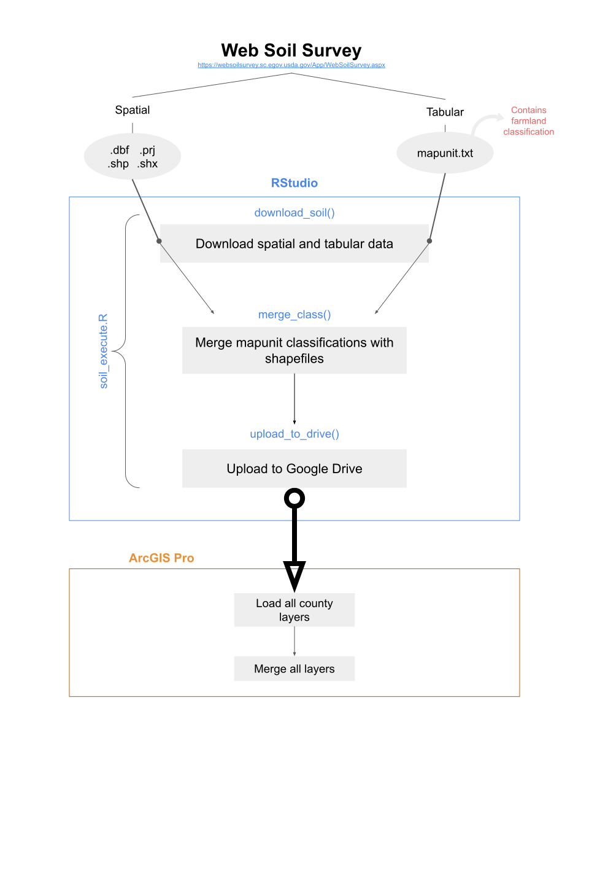

# ssurgo-soil

Retrieves and merges SSURGO soil shapefiles with farmland classification tabular data, then uploads them to a specified Google Drive folder. Once the data has been imported to Google Drive, use Python notebook in ArcGIS Pro project to import and merge geospatial data *(coming soon)*.




## Preliminary Set-Up

### Specify Directories, Authorize Google Account
Everything you will need is in the **soil_project** folder in this repository. The **soil_execute.R** file (in the **code** directory) contains everything needed to execute the entire project (from Alabama to Wyoming). Before running, carefully examine the global variables and ensure all directory names match their names in your current R session (they should be ready as-is, but if you happen to change any file names, you must update them here to avoid errors). You will also specify your Google account and target Drive directory here.

```r
#---------------SET GLOBAL VARIABLES----------------#


#----DIRECTORIES----#

#main directory
main_dir <- "soil_project"

#soil excel zip reference directory
zip_dir <- "state_zip"

#mapunit repository directory
mapunit_dir <- "mapunit"

#spatial repository directory
spatial_dir <- "spatial_soil"

#code directory
code_dir <- "code"

#etc., etc.
```
### Prep Download Links

After a few basic checks to ensure the file system is ready to receive the downloaded data, the code will create a vector called **all_states_excel** containing the name of each state's excel file, which contains the download link to every county's zipped soil data folder. The excel files themselves are stored in the **zip_dir**. Here are the first few entries of the vector:

```r
> head(all_states_excel)
[1] "soil_zip_county_AL.xlsx" "soil_zip_county_AZ.xlsx"
[3] "soil_zip_county_AR.xlsx" "soil_zip_county_CA.xlsx"
[5] "soil_zip_county_CO.xlsx" "soil_zip_county_CT.xlsx"
```

## Execute Project Code

The for loop downloads, merges, and uploads to Drive directory **all** states' data.

In the process, the for loop calls three functions:

* **download_soil()** downloads a county's entire zipped soil folder, then extracts the mapunit and spatial files, depositing them the mapunit and spatial directories, respectively
* **merge_class()** merges the mapunit farmland classifications with the corresponding shapefile (in ArcGIS Pro, farmland classification will now show up as an attribute)
* **upload_to_drive()** uploads each county's now-merged spatial files to the Drive space specified above.


## Further Information

### What does "mapunit" mean and why is it important?
Mapunits are the most basic units of soil surveys. Functionally, they are polygons representing an area that contains more or less the same kind of soil. In each SSURGO dataset, tables called "mapunit" contain, among other metrics, [farmland classifications](https://www.nrcs.usda.gov/wps/portal/nrcs/detailfull/pr/soils/?cid=nrcs141p2_037285) compiled by the NRCS. Each mapunit code has been assigned a farmland classification, indicating its suitability for agricultural use. Our project uses these classifications as an input feature in our Ricardian land value models. 


### Helpful links

* More on [SSURGO](https://www.nrcs.usda.gov/wps/portal/nrcs/detail/soils/survey/?cid=nrcs142p2_053627)
* Several non-base R packages were used in this project. 
    * [googledrive](https://googledrive.tidyverse.org/)
    * [readxl](https://readxl.tidyverse.org/)
    * [stringr](https://stringr.tidyverse.org/)
    * [utils](https://cran.r-project.org/web/packages/R.utils/index.html)
    * [readr](https://readr.tidyverse.org/)
    * [dplyr](https://dplyr.tidyverse.org/)
    * [rgdal](https://cran.r-project.org/web/packages/rgdal/index.html)
    * [sp](https://cran.r-project.org/web/packages/sp/index.html)
    * [downloader](https://cran.r-project.org/web/packages/downloader/index.html)
    * If they are not fetched automatically and produce errors, install them manually:
    
```r
utils::install.packages(c("googledrive","readxl","stringr","utils","readr","dplyr","rgdal","sp","downloader"))
```


