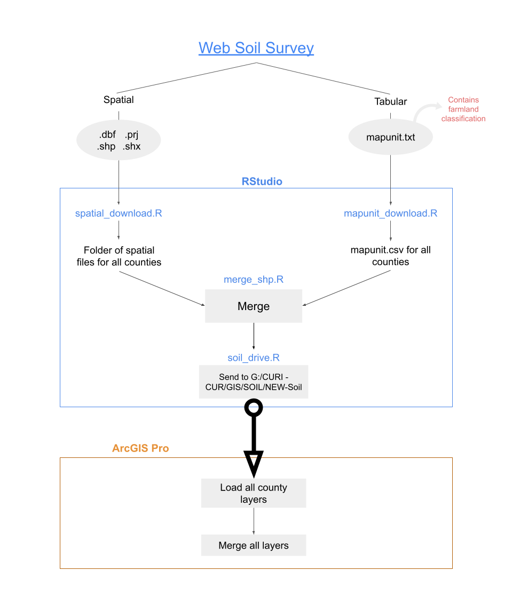

# ssurgo-soil

**NB: This project is currently in development. The code in this repository only processes one state (i.e., the user must manually set a new state each time). The final version will allow the user to process all states automatically, with minimal manual input required. Python code for automated importation into ArcGIS Pro will be added to this repository in February 2022**

Scrapes, processes, and merges SSURGO soil shapefiles with farmland classification tabular data and uploads them to a specified Google Drive folder.

Total time required: ~4 hrs



## Step 1: Manually create state zip dataset

This is the most time-consuming part of the process. Because the Web Soil Survey operates in a dynamic .aspx environment, typical R scraping methods (e.g., Rvest package) don't work. So the first step consists of visiting the [web page](https://websoilsurvey.sc.egov.usda.gov/App/WebSoilSurvey.aspx) and selecting the "Download Soils Data" tab. Within this dynamic page, select the desired state (in this example, Minnesota). Then scroll down to the "Soil Survey Area (SSURGO) Download Links" section and copy the entire box, from the name to the download link text, for all counties. Then paste this in an excel document. **Delete the columns between the fips code and the download text.** You won't need them. The resulting data should have three columns: county name, county fips code, and download link.

Next, name the file "soil_zip_county_*ST*" (*ST* = two-letter state abbreviation). Upload this .xlsx file to an RStudio session.

## Step 2: Download and process mapunit tabular data

In each SSURGO dataset, tables called "mapunit" contain, among other metrics, [farmland classifications](https://www.nrcs.usda.gov/wps/portal/nrcs/detailfull/pr/soils/?cid=nrcs141p2_037285) compiled by the NRCS. The code in **mapunit_download.R** scrapes the entire SSURGO zip file from the Web Soil Survey site, then loads each county's mapunit, cleaning and processing it before depositing it in a local R folder called "mapunit" (folder names and locations may be changed but must be reconciled with the source code). 

To run the code successfully, ensure your excel file(s) are properly named before sourcing the script. 

Runtime: ~1 hr

## Step 3: Download geospatial files

Each SSURGO dataset contains spatial directories containing shapefiles and their support scripts. **spatial_download.R** scrapes the entire SSURGO zip file from the Web Soil Survey site, then loads each county's spatial directory into a directory. The script below shows how to quickly create such directories in your local R file system (in the source code, it is nullified with #'s to ensure it does not run and overwrite existing shapefile directories). Note: "Land_Use_Rights" was our team directory in RStudio Work Bench.

```r
#create county directories to fill with spatial files [ONLY RUN ONCE]
create_path <- file.path(getwd(),"Land_Use_Rights","spatial_soil")
for(i in 1:nrow(soil_zip)) {
    c_file <- as.character(soil_zip[i,2])
    path <- file.path(create_path,c_file)
    dir.create(path,showWarnings = TRUE) 
}
```

Runtime: 1-2 hrs

## Step 4: Merge geospatial files with mapunit data

Not much explanation required. Source **merge_shp.R**, which merges the files, then overwrites the old spatial files with the merged shapefile (now containing farmland classification).

Runtime: ~1 hr

## Step 5: Upload merged files to Google Drive

When you source **soil_drive.R**, it will likely require you to authorize the connection using a gmail account that has access to whatever you've set as "NEW_soil_dir." It will then upload all merged shapefiles (and support files) to the specified Google Drive directory.

Runtime: ~30 mins

Now you are ready to load the shapefiles into ArcGIS Pro.

